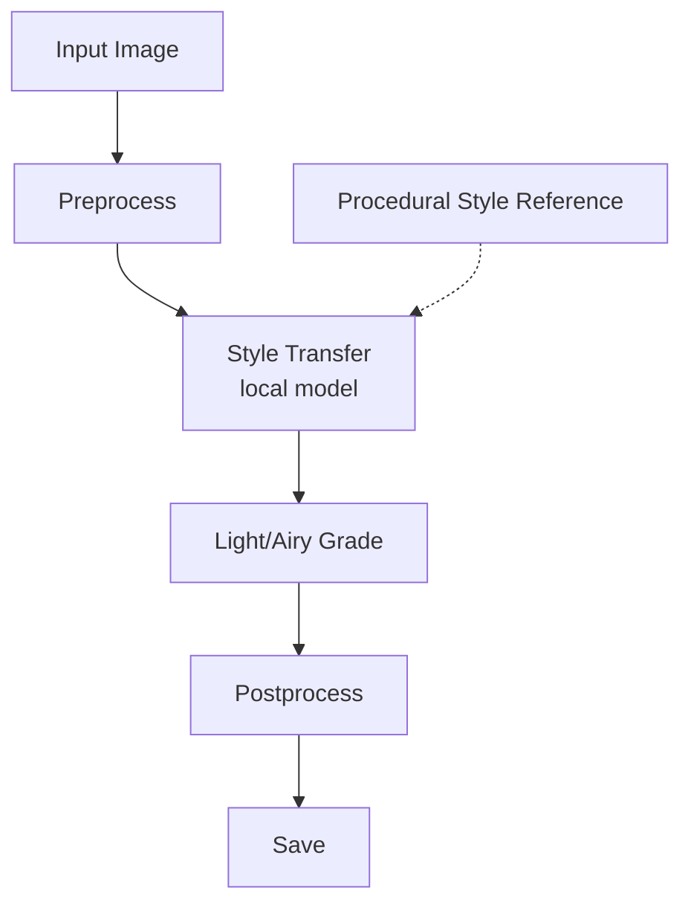

# Architecture

The `light_restyle` project relies on a two-stage pipeline to achieve its signature look.

## Rationale for the Two-Stage Design

1. **Stage 1: Style Transfer (`style_transfer.py`)**
   We use a local TensorFlow Hub model (`magenta/arbitrary-image-stylization-v1-256`) to stylize the input based on a procedurally generated "light & airy" texture reference. This handles the "recreate it artistically" part, fundamentally changing the texture and soft geometry of the image.

2. **Stage 2: Deterministic Color Grade (`color_grade.py`)**
   Neural networks alone cannot be fully trusted to hit a precise color target consistently across wildly different lighting conditions. A separate deterministic grading stage lifts shadows, softens highlights, reduces contrast, desaturates slightly, and warms the image. This guarantees the high-key look every single time, regardless of what the style network produces.

This is the standard way production photo-styling tools stay consistent.

## Strict Code Rules

All logic in this project adheres to strict style rules:
- No comments in source files (all rationale belongs here).
- Full type hints.
- No magic numbers (everything lives in `config.py`).
- Single-purpose pure functions.
